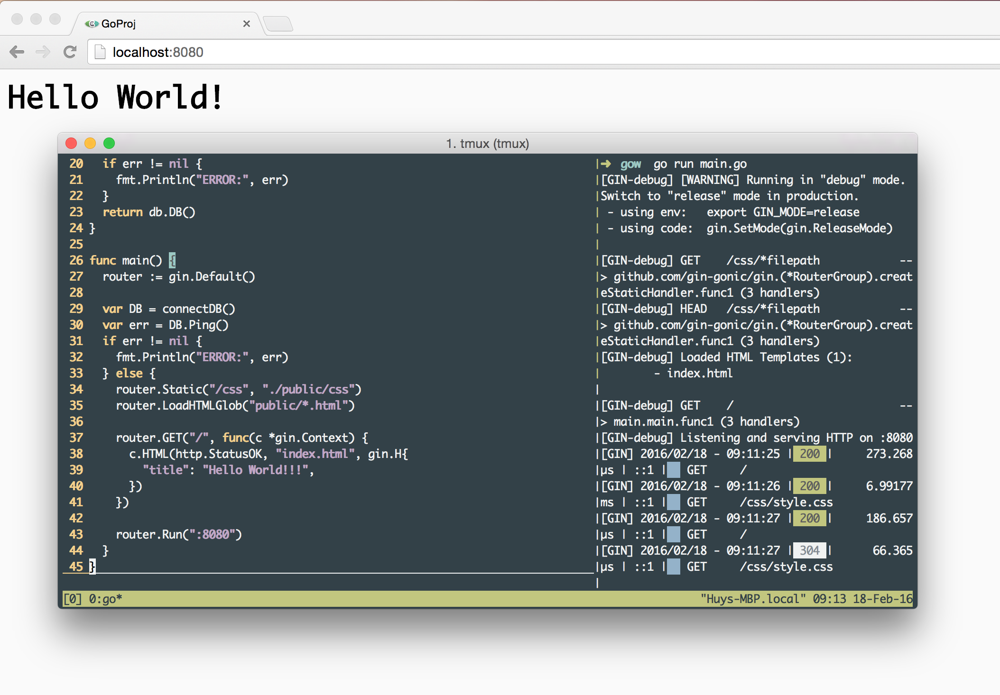

# Go Web Starter



Starter Go Web Project, using:
- Gin ([https://gin-gonic.github.io/gin/](https://gin-gonic.github.io/gin/))
- GORM ([https://github.com/jinzhu/gorm](https://github.com/jinzhu/gorm))
- PostgreSQL

# Project structure

```
go-web-starter
|-- main.go                 
|-- server.go               
|-- app.go                  
|-- *.model.go
|-- public
     |--- index.html
     |--- *.html
     |--- css
           |--- style.css
           |--- *.css
```

### Routing
All routing will be put in `server.go`. You can manage all your route in this way:

```go
// All routing here
router.GET("/", app.Home)
router.POST("/add", app.Add)
router.POST("/delete", app.Delete)
```

### Models
Define each of your model in a single file, with the name of `<name>.model.go`. For example, this is our `Post` model:

```go
package main

import "time"

type Post struct {
	ID        int
	Message   string `sql:"size:255"`
	CreatedAt time.Time
}
```

### Ensure database
After define `models`, you need to ensure that the database (`PostgreSQL`) always contains the needed tables for your `models`.

In `server.go`, use `CreateTable` function to create your table if it's does not exist or need to be updated (`models` changed).

```go
DB.CreateTable(...)
```

This function will does nothing if your table already exist.

### Controller
We handle all of our routing in `AppController` (`app.go` file).

Each handler should follow this format:

```go
func (a *AppController) ActionName(c *gin.Context) {
	...
}
```

# How to build and run
Run this command to build the project to single executable file named `server`:

```bash
go build -o server
```

Then run it:

```bash
./server
```
